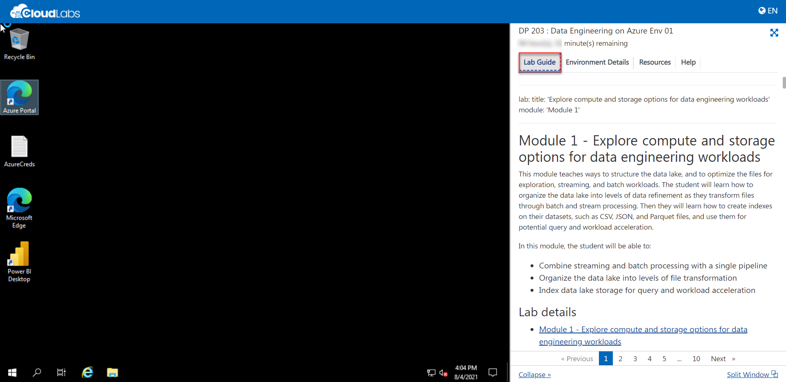
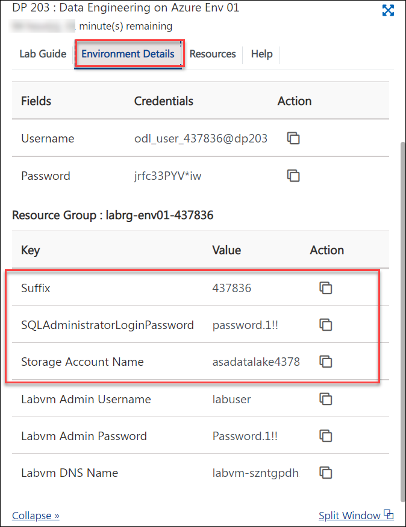
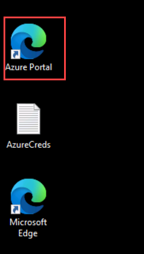
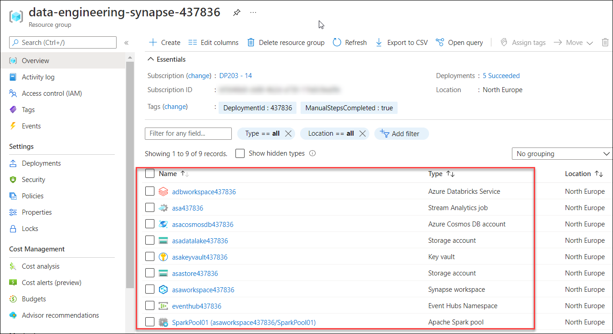

## **Getting Started**

1. Once the environment is provisioned, a virtual machine and lab guide will get loaded into your browser. Use this virtual machine throughout the workshop to perform the lab.
   
   
   
1. To get the lab environment details, you can select the Environment Details tab. Additionally, the credentials will also be sent to your email address provided during registration.

   

### Log-in to the Azure portal and verify the pre-deployed resources

1. In the LabVM, double click on the **Azure portal** shortcut on the desktop.

      
     
1. On **Sign in to Microsoft Azure** blade, you will see a login screen, in that enter the following email/username and then click on **Next**.  
   * **Azure Username/Email**:  <inject key="AzureAdUserEmail"></inject>
   * **Azure Password**:  <inject key="AzureAdUserPassword"></inject>
  
1. If you see the pop-up like below, click **Skip for now(14 days until this is required)**.

   

1. If you see the pop-up  **Stay Signed in?**, click **No**.

1. If you see the pop-up **You have free Azure Advisor recommendations!** , close the window to continue the lab. 

1. If a **Welcome to Microsoft Azure** popup window appears, click **Maybe Later** to skip the tour.

1. Now you can see the Azure Portal Dashboard, click on **Resource groups** from the Navigate panel to see the resource groups.
  
    
     
1. Navigate to the **data-engineering-synapse-<inject key="DeploymentID"></inject>** Resource group and verify whether you have all the below resources deployed successfully.
  
     

   - Azure Databricks Service
   - Stream analytics job
   - Azure Cosmos DB
   - Two Storage Accounts
   - Key vault
   - Synapse workspace
   - Event hub namespace
   - Apache spark pool
  
1. Please ensure to **pause** the SQLPool whenever the environment is not in use.

    

1. Please ensure to **stop** the virtual machine from the **Resources** tab whenever the environment is not in use.

    
   
   **Environment Uptime** : Lab environments typically include Virtual Machines and SQL Pool. VMs and SQL Pool have uptime limits to keep the cloud costs under control.Lab Duration and uptime limits are defined based on the average required time to complete the labs along with some buffer. This Lab environment includes 18 Hours of SQL Pool and VM uptime limit. Once the uptime limit is reached, all resources will remain in stopped/pause resource.

1. Click on **Next** from the bottom right corner and follow the instructions to perform the lab.

## Modules Included

  In this hands-on lab you will be performing the below modules:

- **Module 01: Explore compute and storage options for data engineering workloads**  
- **Module 03: Data Exploration and Transformation in Azure Databricks**
- **Module 04: Explore, transform, and load data into the Data Warehouse using Apache Spark**
- **Module 05: Ingest and load data into the data warehouse**
- **Module 06: Transform data with Azure Data Factory or Azure Synapse Pipelines**
- **Module 07: Integrate data from Notebooks with Azure Data Factory or Azure Synapse Pipelines**
- **Module 08: End-to-end security with Azure Synapse Analytics**
- **Module 09: Support Hybrid Transactional Analytical Processing (HTAP) with Azure Synapse Link**
- **Module 10: Real-time Stream Processing with Stream Analytics**
- **Module 11: Create a Stream Processing Solution with Event Hubs and Azure Databricks**
 
